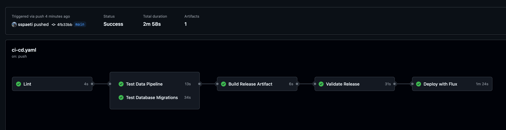
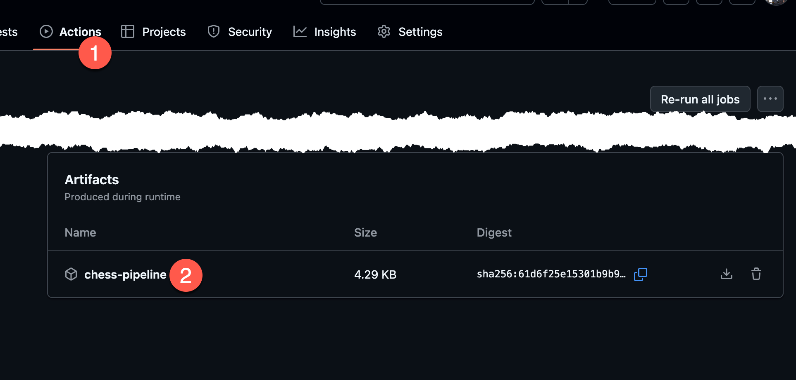

# GitOps Infrastructure with Flux CD, Kestra, and CI/CD Pipelines

This repository contains a GitOps infrastructure setup using Flux CD to manage Kubernetes applications and resources. It's a GitOps infrastructure example using Kestra workflows, and Liquibase migrations with complete CI/CD pipeline implementation.


> 📝 **Also find general Best Practices for Deployment Organization**
>
> On [deployment-blueprint-gitops](https://github.com/ssp-data/deployment-blueprint-gitops) you'll find  best practices for deploying open data stacks on Kubernetes using GitOps principles, focusing on efficient patterns that work well with modern DevOps workflows. that blueprint repo is not a working copy, but has insights on how to structure a enterprise scale repo, where as this GitOps repo here is more focused on working example.


## Overview

This infrastructure repository demonstrates how to use Flux CD for GitOps-driven deployments, including:

- Flux system components
- Kestra workflow orchestration platform via Helm chart
- Database migrations with Liquibase
- CI/CD pipelines with GitHub Actions

## CI/CD Pipeline on GitHub with GitHub Actions

This repository includes a [GitHub Actions CI/CD workflow](.github/workflows/ci-cd.yaml) that automatically tests and deploys changes. Check out [recent runs](https://github.com/ssp-data/gitops-flux-pipeline-showcase/actions) to get an overview what happens. Scripts that run can be found in [`scripts/ci/`](scripts/ci).



### CI Pipeline Features

- **Linting**: Validates Kustomize resources and Kestra pipeline syntax
- **Data Pipeline Testing**: Tests the data pipeline logic directly using pytest
- **Database Schema Testing**: Validates Liquibase migrations
- **Artifact Building**: Creates versioned release artifacts
- **Deployment Testing**: Deploys infrastructure to a test cluster using Flux

### Testing Approach

For CI/CD testing without a full Kubernetes environment:

1. **Data Pipeline Tests**: Tests the pipeline logic directly with pytest and mocks, not through Kestra
2. **Liquibase Tests**: Runs against a PostgreSQL service container that's spun up for the tests
3. **Artifact Building**: Creates a versioned artifact with code, migrations and metadata
4. **Infrastructure Testing**: Uses Kind to create a temporary Kubernetes cluster for infrastructure validation

## Release Process

The CI/CD workflow:

1. Tests all components separately
2. Builds a versioned artifact (e.g., chess-pipeline-20250512123045.tar.gz) (see point 2.)

3. Validates the artifact's contents 
4. Deploys the infrastructure using Flux in a test environment
5. For production, you would manually promote tested releases

### Creating a Release for CI Testing

To create a new release that can be tested in CI:

1. **Make your changes** to the codebase (pipelines, migrations, etc.)

2. **Commit and push your changes** to GitHub:
   ```bash
   git add .
   git commit -m "Your descriptive commit message"
   git push origin main
   ```

3. **Monitor the CI pipeline** in GitHub Actions:
   - The pipeline will automatically run when you push to main
   - It will validate kustomize resources, test the data pipeline, and test migrations
   - If these steps pass, it will build an artifact and deploy to a test cluster

4. **CI Artifacts**:
   - The pipeline automatically creates a versioned artifact containing your pipeline code and migrations
   - Artifacts are named using timestamps (e.g., `chess-pipeline-20250514120000.tar.gz`)
   - These artifacts can be downloaded from GitHub Actions for manual testing or deployment

5. **Fix CI Issues**:
   - If the "validate kustomize resource" step fails, ensure your kustomization files are properly structured
   - Remember all paths in kustomization files should be relative to the file location
   - Use the `--load-restrictor=LoadRestrictionsNone` flag when validating external references

## Directory Structure

```
clusters/             # Kubernetes manifests managed by Flux
  └── my-cluster/     # Cluster-specific configuration
      ├── flux-system/ # Flux components
      ├── kestra/     # Kestra deployment 
      └── migrations/ # Database migrations

workspaces/           # Application code and pipelines
  └── pipelines/      # Kestra pipeline definitions
      ├── dlt/        # Python data pipeline code
      └── tests/      # Test pipelines

scripts/              # CI/CD and utility scripts
  └── ci/             # CI pipeline scripts

migrations/           # Local migration files
  └── changelog/      # Liquibase changelog definitions
```

## Kestra Data Pipelines

The example includes a simple data pipeline that:

1. Fetches chess player data from a public API
2. Processes the data with DLT
3. Outputs the results to a database

### Working with Kestra Pipelines

#### Adding a New Pipeline

1. **Create a new YAML file** in the `workspaces/pipelines` directory:
2. **Test your pipeline**:
   - The CI will automatically validate the YAML syntax
   - For local testing, upload it to your Kestra UI and execute it
3. **Add Python code** if needed:
   - Place Python scripts in the `workspaces/pipelines/dlt` directory 
   - Use underscores in filenames instead of hyphens (e.g., `my_script.py` not `my-script.py`)
   - Create unit tests in the `workspaces/pipelines/tests` directory
   - Run tests locally with: `cd workspaces/pipelines && pytest tests/`
4. **Commit and push your changes**:
   ```bash
   git add workspaces/pipelines/new-pipeline.yml
   git commit -m "Add new data pipeline"
   git push origin main
   ```

## Database Migrations

Database migrations are managed with Liquibase:

1. Simple schema with players table
2. Migrations applied automatically via Kubernetes job
3. Changes tracked in version control

### Adding a New Database Migration

To add a new database migration:

1. **Create a new changeset** in the master changelog file or add a new changelog file:
   ```yaml
   # In migrations/changelog/db.changelog-master.yaml
   databaseChangeLog:
     - changeSet:
         id: 1
         author: sspaeti
         changes:
           - createTable:
               # Existing table definition...

     # Add your new changeset
     - changeSet:
         id: 2
         author: your-name
         changes:
           - addColumn:
               tableName: players
               columns:
                 - column:
                     name: new_column
                     type: varchar(255)
   ```

2. **Commit and push your changes**:
   ```bash
   git add migrations/changelog/db.changelog-master.yaml
   git commit -m "Add new_column to players table"
   git push origin main
   ```

3. **CI will automatically test your migration** against a test database
   - The job will fail if there are any issues with your migration script
   - You can view the results in the GitHub Actions tab

Once approved and merged, Flux will automatically apply your database changes by running the Liquibase migration job in the cluster.

## Local Development and Testing

### Prerequisites

- Kubernetes cluster
- Flux CLI installed
- `kubectl` configured

### Bootstrapping Flux Locally

To bootstrap Flux on your local cluster:

```bash
export GITHUB_USER=<your-github-username>
make flux-bootstrap
```

### Local Makefile Commands

The repository includes a [Makefile](Makefile) with common commands to run Flux reconcile, status or port forwards when run locally.

#### Running Pipelines Locally

1. **Access the Kestra UI**:
   ```bash
   make port-forward-kestra
   ```
   Then open `http://localhost:8082` in your browser

2. **Upload a Pipeline**:
   - In the Kestra UI, navigate to Flows → Create → Upload YAML
   - Select your pipeline YAML file from the `workspaces/pipelines` directory
   - Click Upload

3. **Execute a Pipeline**:
   - Click on your pipeline in the Flows list
   - Click "Execute" button in the top right
   - Monitor the execution progress in the UI

#### Testing Database Migrations Locally

To test your migration locally:
```bash
# Install Liquibase if needed
# Run the migration against your development database
cd migrations
liquibase update
```
